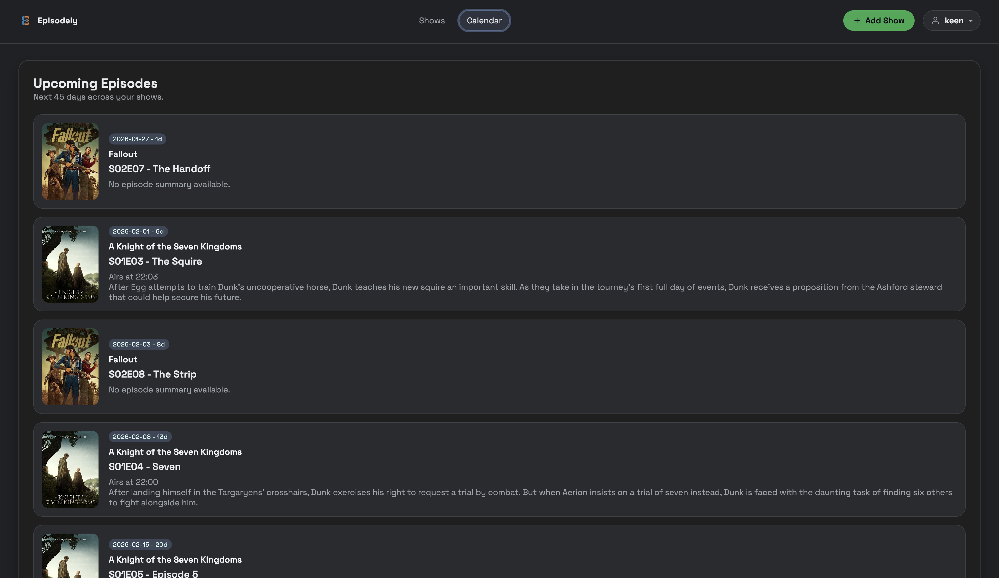
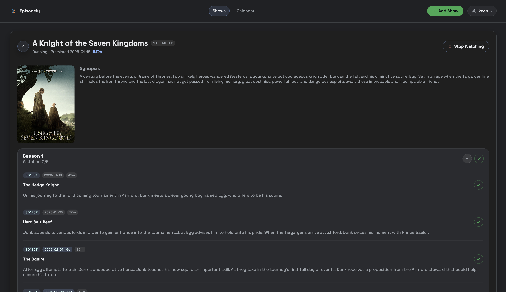
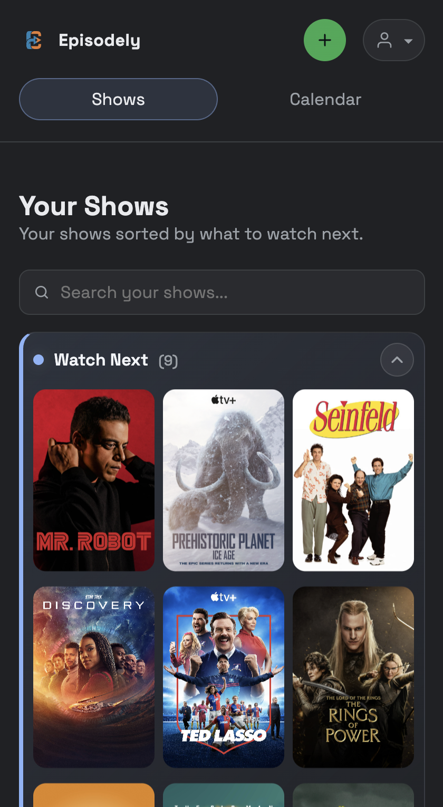
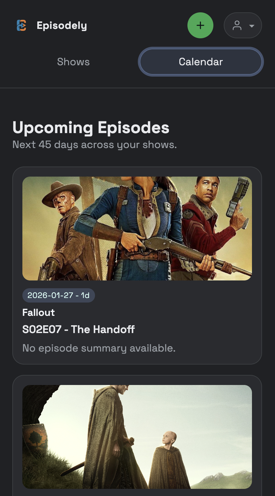
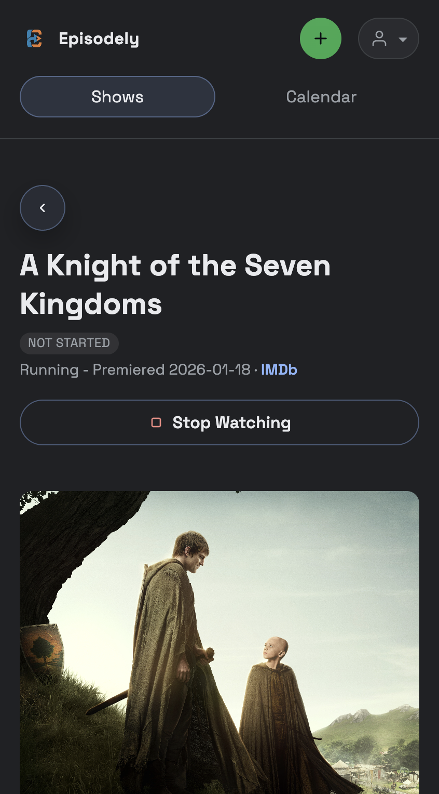

# Episodely

Episodely is a self-hosted web app for tracking watched TV series. It aims to provide the core watch tracking flow of TV Time with a local-first setup, plus calendar views for upcoming releases and import/export to make migration easy. Episodely is created to replace TV Time and is developed primarily with OpenAI Codex.

Status: v1.0 release.

## Goals
- Simple, fast watch tracking for TV series
- Calendar views for upcoming episodes and releases
- Easy import/export for migration in and out
- Self-hosted and Docker-first, similar to the *arr suite

## Features
- Track watched/unwatched status, seasons, and episodes
- Release calendar for upcoming episodes
- Data refreshes automatically (daily) for show and episode updates
- Import/export for backups and migration
- Multi-user support with profiles
- Change account password from settings
- TVmaze metadata and imagery (no API key required)
- Show lists grouped by status (watch next, not started, up to date, finished, stopped watching)
- IMDb link in show details when available

## Screenshots

 

 

 

<table cellpadding="8">
  <tr>
    <td></td>
    <td></td>
    <td></td>
  </tr>
</table>

## Stack
- UI: React + Vite
- Backend: Node.js + Express
- Storage: SQLite

## Quick Start (Local)
Requirements: Node.js 22+

- `npm install`
- `npm run dev` starts Vite (web) and the Express API together
- `npm run build` builds the UI to `dist/`
- `npm run start` serves the API and the built UI from one process
- `npm test` runs the Vitest suite

The API is available at `http://localhost:4285/api/health` during development.
The Vite dev server listens on `localhost:5173` by default. Override with
`VITE_HOST`, `VITE_PORT`, and `VITE_API_TARGET` in `.env` if needed.

## Dev Container
This repo includes a `.devcontainer/` setup pinned to Node.js 22 with ports
5173 (Vite) and 4285 (API) forwarded. The container sets `VITE_HOST=0.0.0.0`
and disables auto-opening the browser for headless workflows.

### First run
- Create an account and log in.
- Create or select a profile.
- Search TVmaze and add shows to your queue.

### Dev autologin + seed data
To preload a development instance (useful for screenshots), set:
- `DEV_AUTOLOGIN=true` to bypass the login screen.
- `DEV_SEED_PATH=/path/to/export.json` to import a backup export on startup.
Optional overrides: `DEV_USER`, `DEV_PROFILE`, and `DEV_PASSWORD`.
For a small sample seed, use `scripts/seed-export.json`.

## Quick Start (Docker)
- `docker compose up`
- Visit `http://localhost:4285`

Set `DB_PATH` in `compose.yaml` or a `.env` file (see `.env.example`). The server generates and stores `SESSION_SECRET` on first start, and the Compose file pulls `ghcr.io/keenfann/episodely:latest` on start.

Sessions are stored in SQLite, so logins persist across restarts as long as `DB_PATH` points to durable storage.

The settings screen version string is set at build time via `APP_VERSION` (defaults to the package version). You can pass it as a Docker build arg when building images.

## Database Migrations
Schema updates run on startup (for example, v1.0 adds `shows.imdb_id` for IMDb links).

## Background Sync
Episodely can refresh show/episode metadata from TVmaze on a schedule. Configure in `.env`:
- `TVMAZE_SYNC_ENABLED` (default `true`)
- `TVMAZE_SYNC_INTERVAL_MS` (default `43200000` / 12 hours)
- `TVMAZE_SYNC_DELAY_MS` (default `500`)
- `TVMAZE_SYNC_ON_STARTUP` (default `true`)

## Project Structure
- `src/` React UI
- `server/` Express API
- `tests/` Vitest suite
- `db/` SQLite database files (local only)
- `data/` Docker volume mount for SQLite
- `vite.config.js` Vite config and API proxy

## Import and Export
Import and export are available in Settings. Exports are JSON backups that can be imported into another instance. Imports also accept a CSV of TVmaze IDs (one per line).
The server also writes automatic weekly JSON exports per profile next to the database (for example `db/exports/user-1/profile-1/`) and retains 52 weeks of backups.

## Contributing
Issues and PRs are welcome. If you plan to work on a larger change, open an issue first to align on scope.

## License
See `LICENSE`.
